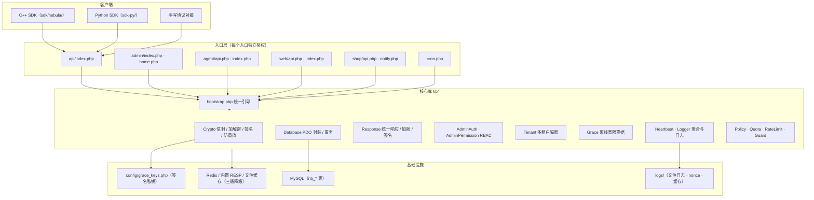
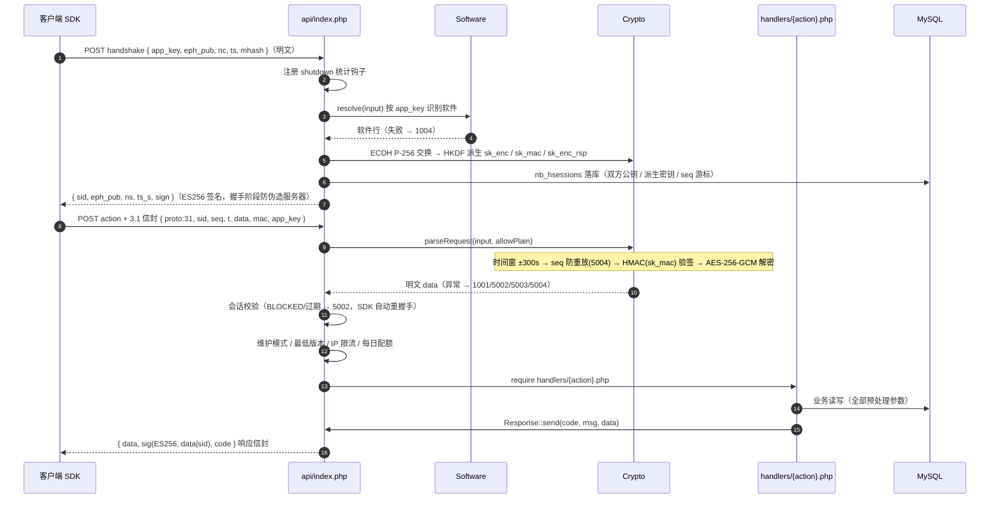
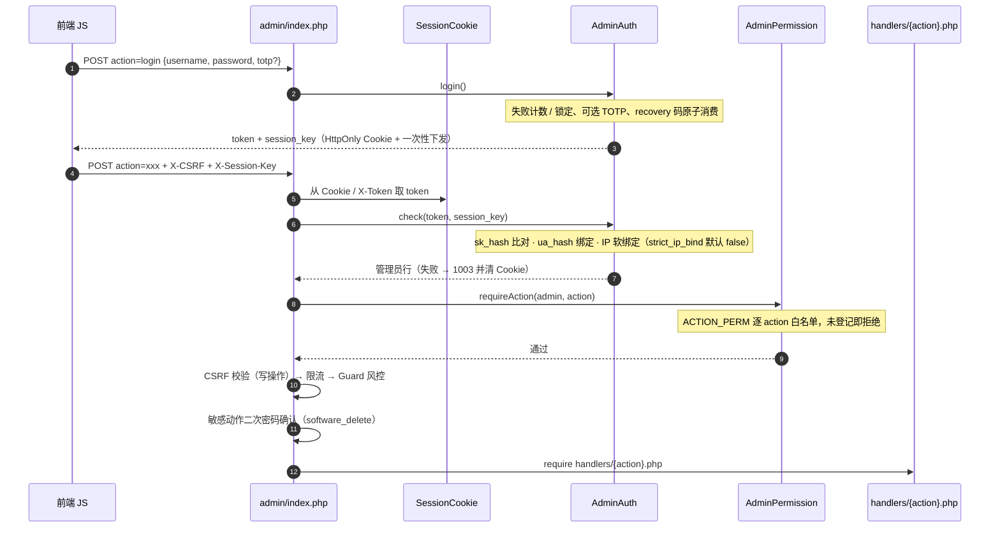
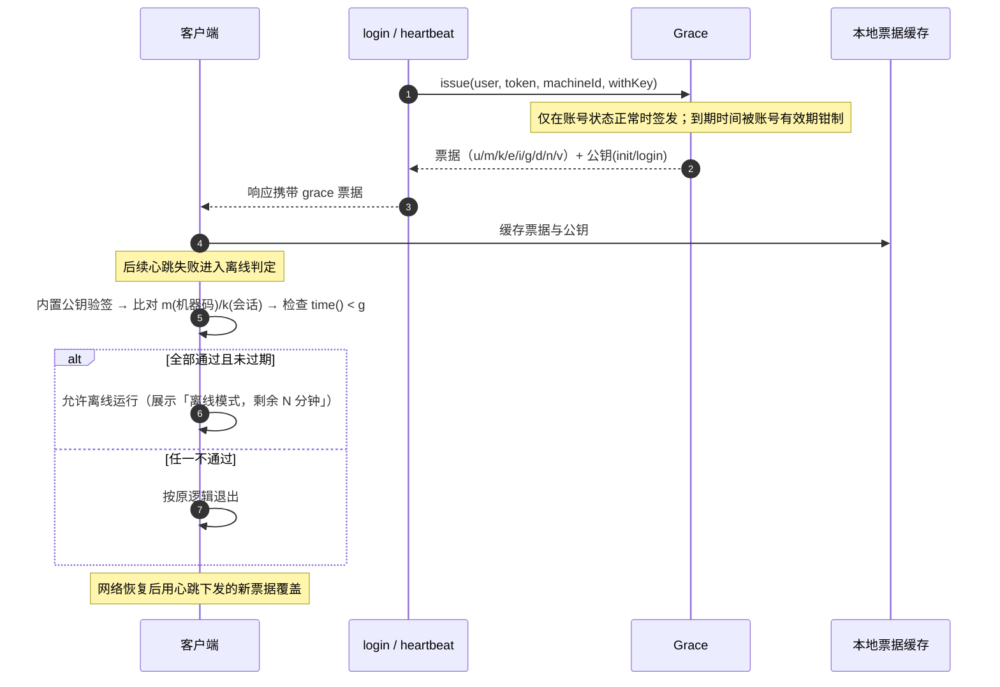
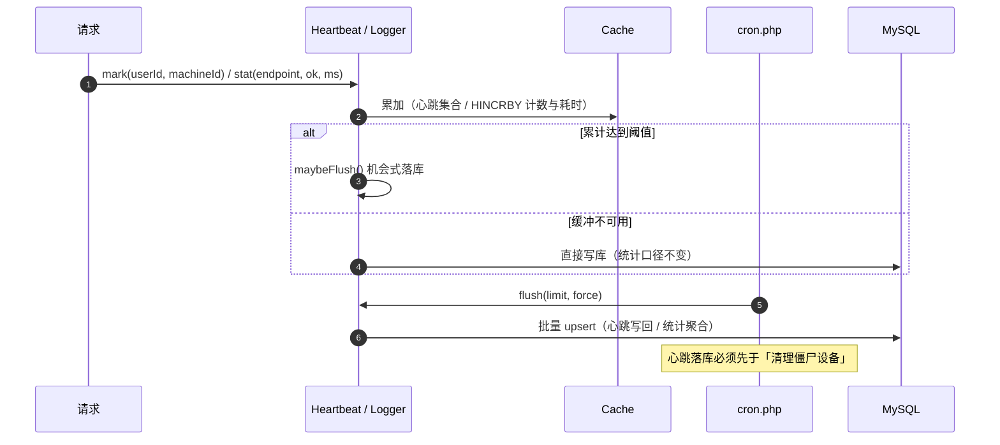
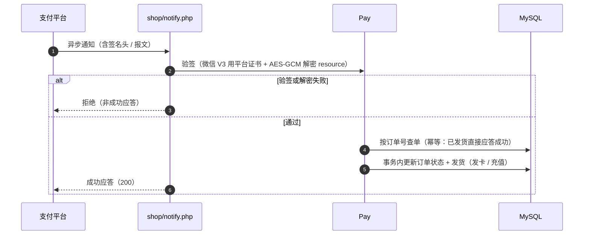
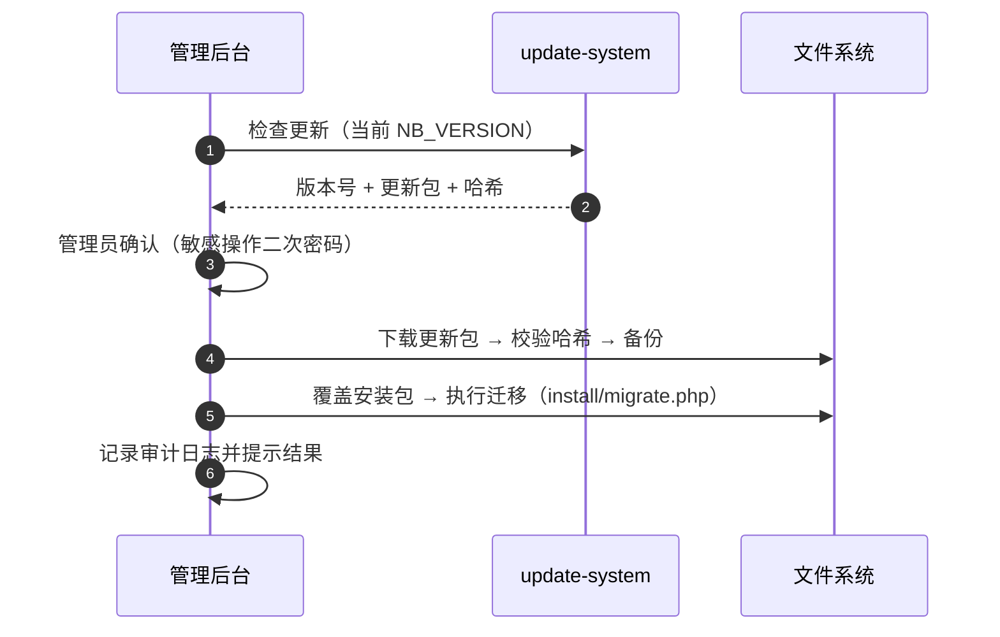

# Nebula 网络验证系统 · 架构设计文档

> 📚 本文属 Nebula 文档中心，主索引见 [README.md](../README.md)，完整指南见 [GUIDE.md](GUIDE.md)；
> 其他文档：[API 接口](API.md) · [报文示例](API_RAW_EXAMPLES.md) · [界面模板](TEMPLATE.md) ·
> [C++ SDK 接入] · [C++ SDK 加固] · [Python SDK]（三套 SDK 文档随官网分发包 sdk.zip / sdk-py.zip 提供，不在本仓库）

本文档描述 Nebula 网络验证系统的整体架构、请求生命周期、关键链路时序与安全设计，
面向二次开发、安全审计与私有化部署运维人员。

- **代码版本**：以 `lib/bootstrap.php` 的 `NB_VERSION` 为唯一真源，本文不写具体版本号（避免漂移）
- **运行环境**：PHP ≥ 8.0（`str_contains` / `str_starts_with` 要求 8.0）、MySQL 5.7+ / MariaDB 10.3+
- **协议真源**：服务端 [`lib/Handshake.php`](../lib/Handshake.php) + [`lib/Crypto.php`](../lib/Crypto.php) 与客户端 `sdk/nebula/client/handshake.hpp`（随官网 `sdk.zip` 分发），二者与 [`docs/API.md`](API.md) 严格对齐

---

## 1. 系统总览

### 1.1 部署形态

系统是一套「授权 / 卡密 SaaS」，由**服务端**（PHP）与**客户端 SDK**（C++ / Python）两大部分组成。
服务端包含六个互相隔离的入口，共用同一套核心库与数据库：

| 入口 | 目录 | 访问者 | 认证方式 |
| --- | --- | --- | --- |
| 客户端 API | `api/` | 接入软件的客户端 | ECDH 会话握手 + AES-256-GCM 信封 + seq 防重放 |
| 管理后台 | `admin/`（可改名） | 平台管理员 / 租户管理员 | X-Token + X-Session-Key + CSRF + RBAC |
| 代理商后台 | `agent/` | 代理商 | 会话 Cookie（NBAGSID）+ CSRF |
| 官网门户 | `web/` | 终端用户 | 官网会话（含多软件分站 `?app=`） |
| 发卡商城 | `shop/` | 购买者 | 商店会话 + 支付回调 |
| 定时任务 | `cron.php` | 系统 | CLI 或 HTTP `?key=<security.cron_secret>`（未配置时自动生成 `logs/cron_secret.txt`） |

### 1.2 分层架构

---

## 2. 请求生命周期

### 2.1 统一引导 `lib/bootstrap.php`

所有入口的第一行都是 `require_once __DIR__ . '/../lib/bootstrap.php'`，引导过程固定为：

1. 基础设置：`error_reporting`、时区（Asia/Shanghai）、`NB_ROOT` / `NB_START` / `NB_VERSION`
2. **安全响应头**：`nosniff`、`X-Frame-Options`、`Referrer-Policy`、`COOP`、`Permissions-Policy`；
   HTTPS 时追加 HSTS；CSP 使用**每请求随机 nonce** 白名单 `script-src`
3. `OPTIONS` 预检直接 204 返回
4. 加载 48 个核心库类（顺序固定，见 `lib/bootstrap.php` 的 `require_once` 段；另有 `error_page.php` 用于统一错误页）
5. 载入 `config/config.php` → `Config::load()`
6. 初始化 `Database` / `Crypto` / `Logger` / `Cache`（缓存配置可被后台设置覆盖）
7. **IP 黑名单**校验（精确 IP 或 CIDR，命中输出自定义 403 页）
8. 解析后台目录名（数据库中 `admin_path`，回落 `admin`）并加载该目录下的 `AdminAuth.php`
9. 注册**全局异常 / 错误 / 致命错误**处理器，统一落日志

### 2.2 客户端 API 管线

`api/index.php` 的处理顺序即为协议的全部前置约束：

各阶段失败的错误码：`1001` 参数、`1004` 软件无效、`5001` 限流、
`5002` 验签/解密失败、`5003` 时间戳超窗、`5004` 重放、`6001` 版本过低、`6002` 维护中。

> **统计可靠性**：调用统计注册在 `register_shutdown_function`，而非 `try/finally`——
> `Response::send()` 内部是 `exit()`，PHP 在 `exit()` 时不执行 `finally`。

### 2.3 管理端管线

管理端在 `admin/index.php` 内完成「无会话接口 → 认证 → RBAC → CSRF → 限流 → 风控 → 敏感操作二次校验」
六道关卡后，再 `require admin/handlers/{action}.php`。详见第 4 节时序图。

---

## 3. 通信协议与安全模型（Nebula 3.1）

> 3.0 静态密钥信封（AES-256-CBC + HMAC + 会话盐 `k` + 密钥平滑轮换）已**完全移除**；
> 当前唯一协议为 3.1：ECDH 会话握手 + AES-256-GCM + seq 防重放。

### 3.1 会话握手

- 客户端生成临时 ECDH P-256 密钥对，明文请求 `handshake`：
  `{ app_key, eph_pub, nc, ts, mhash }`（`nc` 为 16 字节客户端随机数）
- 服务端生成自己的临时密钥对，响应 `{ sid, eph_pub, ns, ts_s, sign }`，
  会话落库 `nb_hsessions`（含双方公钥、派生密钥、seq 游标，TTL 到期/失效即删）
- `sign` = 服务端对 `sid|eph_pub_S|ns|nc|ts_s` 的 ES256 签名，客户端用内置公钥先验签——
  **防伪造服务器**（握手阶段即可识别假服务端，对称密钥从未离开服务端）

### 3.2 密钥派生与业务信封

- 共享密钥 = ECDH 双方私钥 × 对方公钥的 X 坐标（32 字节大端）
- `sk_enc` = `hash_hkdf('sha256', shared, 32, 'nebula31-enc', nc‖ns)`；
  `sk_mac` = 同法 info=`nebula31-mac`
- IV = `sha256(nc‖ns)` 前 4 字节 ‖ `seq` 大端 8 字节（每会话 IV 空间独立）
- 业务请求：`{ proto:31, sid, seq, t, data, mac, app_key }`，
  `data = base64(IV[12] + AES-256-GCM(业务JSON) + tag[16])`，
  `mac = HMAC-SHA256(sk_mac, sid|seq|t|sha256(data))` 小写 hex
- **防重放**：`seq` 必须单调递增，服务端按会话游标校验，旧序号返回 `5004`
- 会话失效（过期/未找到）返回 `5002`，SDK 自动重握手重试一次

### 3.3 响应防伪造

响应 `{ data, sig, code }` 由服务端**私钥签名**（ES256，签名对象 `data|sid`），
客户端内置公钥验签——先验签后解密。逆向端即使完整 dump 客户端内存也拿不到
任何可复用的对称机密（握手密钥对是临时的，私钥不落盘），无法解密历史流量或伪造响应。

> 协议唯一参照：服务端 [`lib/Handshake.php`](../lib/Handshake.php) +
> [`lib/Crypto.php`](../lib/Crypto.php)，客户端 `sdk/nebula/client/handshake.hpp`
> （随官网 `sdk.zip` 分发）；字段详见 [`docs/API.md`](API.md)。

> 客户端离线校验的票面与验签步骤见第 5 节；协议字段见 [`docs/API.md`](API.md) 的
> 「离线宽限协议」与「响应防伪造」章节。

---

## 4. 管理端鉴权

管理端是全站权限最高的一环，采用**多因子 + 默认拒绝**：

关键设计点：

- **token 与 session_key 分离**：token 只是会话标识，泄露即可冒用；session_key 仅登录下发一次，
  服务端只存 `sk_hash`（SHA-256），拿到库也反推不出明文。历史会话 `sk_hash` 为 NULL 时按旧模型放行（升级不踢人）
- **UA 绑定**：`ua_hash` 不一致即吊销会话
- **IP 软绑定**：IP 变化默认只记录（`admin.strict_ip_bind=false`），可配置为硬拦
- **RBAC**：`lib/AdminPermission.php` 的 `ACTION_PERM` 表覆盖全部管理接口，未登记的动作直接拒绝
- **CSRF**：写操作必须带 `X-CSRF` 或 `body.csrf`，只读接口在 `$csrfExempt` 白名单中豁免
- **风控**：`Guard::assess()` 判定自动化则拒绝并累计风险分；已登录管理员豁免封禁（保留自救通道）

---

## 5. 离线宽限票据

服务端抖动或网络闪断时，客户端不应被误踢。`lib/Grace.php` 在 `login` / `heartbeat` 响应中
下发一张**服务端私钥签名的紧凑票据**（前缀 `G1`）：

**取舍**：离线期间服务端无法撤销票据，因此宽限时长默认 1 小时且被账号有效期钳制；
封号用户最多离线到票据到期。该机制的目标是「防服务端抖动误伤」，而非「防破解」——
真正的防盗版拦截仍在联网校验路径上。票据字段与验签伪代码见 [`docs/API.md`](API.md) 的「离线宽限协议」。

---

## 6. 多租户数据隔离

`lib/Tenant.php` 实现「代理商以管理员身份登入总后台」时的可见范围约束，设计原则是**默认拒绝**：

| 角色 | 判定 | 可见范围 |
| --- | --- | --- |
| 平台管理员 | `admins.agent_id = 0` | 全部软件及其数据 |
| 租户管理员 | `admins.agent_id > 0` | 仅 `softwares.owner_agent_id = 该代理商` 的软件及其用户 / 卡密 / 设备 |

调用契约：

| 方法 | 用途 |
| --- | --- |
| `Tenant::applyNamed()` / `applyPositional()` | 列表查询注入 `software_id IN (...)` 过滤 |
| `Tenant::requireTouch()` | 单条写操作按 `software_id` 越权即拒绝（4031） |
| `Tenant::touchRow()` | 先读记录再按行归属校验 |
| `Tenant::requireTouchAll()` | 批量操作：任一条越界即整单拒绝 |
| `Tenant::requireTouchUser()` | 用户链路（`users.software_id`） |
| `Tenant::requireTouchDevice()` | 设备链路（`device → user → software_id` 推导） |

`Tenant` 依赖 `$GLOBALS['nb_admin']`（由 `admin/index.php` 在认证后设置）。
**注意**：无法确定归属的数据一律不可见——`softwareScope()` 在列缺失等异常时返回空数组而非 null。

---

## 7. 数据与聚合

### 7.1 缓存三级降级

`lib/Cache.php` 按 `Redis → 内置 RESP → 文件` 顺序降级；文件目录不可写时整个缓存关闭，
调用方自动回落到原数据库路径。后台「系统设置 → 缓存与 Redis」可覆盖出厂配置，
但仅覆盖**显式保存过**的键，非法值一律忽略，不会因误配把缓存打挂。

### 7.2 心跳与统计缓冲

心跳（`devices.last_seen`）与调用统计（`api_stats`）都是高频写。启用缓冲后：

`cron.php` 每分钟执行：心跳落库 → 统计落库 → 清理过期会话 / 僵尸设备 / 限流记录 / 日志 /
nonce / 旧文件日志 → 写入在线快照 `nb_online_stats`。未配 cron 不会积压（机会式落库兜底），
但在线曲线会有缺口。

---

## 8. 支付与发卡

`shop/notify.php` 处理第三方支付异步回调，核心是「先验签、再解密、再幂等发货」：

微信 V3 回调的验签、解密与应答规范见 [`docs/API.md`](API.md) 的「支付回调（异步通知）」章节，
协议级单测见 [`tests/wechat_v3_notify_test.php`](../tests/wechat_v3_notify_test.php)。

---

## 9. 运维能力

### 9.1 在线更新

后台「系统更新」对接 `update-system` 版本服务器：

### 9.2 备份、安全审计与文件完整性

| 能力 | 实现 | 说明 |
| --- | --- | --- |
| 数据库备份 | `lib/Backup.php` | 定时自动备份，可配置保留份数 |
| 安全审计报告 | `lib/SecReport.php` | 每日巡检暴力破解 / 撞库 / 密钥重置 / 卡密突增 |
| 文件完整性 | `lib/FileGuard.php` | 全站 sha256 基准比对 + Webshell 特征扫描 |
| 健康检查 | `lib/Health.php` | 环境与依赖自检 |
| 运行时防护 | `lib/RuntimePolicy.php`、`lib/RuntimeGuard.php`、`lib/RuntimeRiskEngine.php`、`lib/RuntimeEventService.php` | 策略匹配下发（软件级 > 全局 > 内置默认）、心跳遥测合并、事件风险评估与自动处置 |

### 9.3 发布与迁移

- **发布工具**：`deploy/make_release.php`（仅开发站），提供 `pack` / `diff` 两个子命令，
  内置敏感文件硬阻断 `assertNoSensitive`
- **空白包 vs 更新包**：`install/migrate_*.php` **不随空白包分发**（`.gitignore` 忽略），
  全新安装由 `schema.sql` 直接建库到基线版本；升级迁移脚本随**更新包**分发
- **迁移执行器**：`php install/migrate.php status|run`，以 `settings.skey='schema_version'`
  登记数据库版本，`MIGRATIONS` 表按版本升序补跑，文件缺失即终止（绝不半升级）

---

## 10. 组件清单（`lib/`）

| 分组 | 类 |
| --- | --- |
| 引导与基础 | `bootstrap.php`、`Config`、`Database`、`Cache`、`Response`、`Util`、`error_page` |
| 通信安全 | `Crypto`、`Grace`（离线票据 / 响应签名）、`Guard`（风控）、`RateLimit`、`Captcha` |
| 认证与权限 | `AdminAuth`（位于后台目录）、`AdminPermission`、`Session`、`SessionCookie`、`Totp`、`Auth`、`LoginMethod`、`ShopAuth`、`Tenant` |
| 业务 | `Software`、`Policy`、`Quota`、`Points`、`Card`、`Device`、`DeviceFp`、`Heartbeat`、`Version`、`Agent`、`AgentCode`、`AgentRecharge`、`WebInteract` |
| 商城与支付 | `Shop`、`Pay`、`UiTemplate` |
| 运维 | `Logger`、`Audit`、`SecReport`、`FileGuard`、`Backup`、`Health`、`Deleter`、`Setting` |
| 运行时安全 | `RuntimePolicy`、`RuntimeGuard`、`RuntimeRiskEngine`、`RuntimeEventService` |

---

## 11. 安全设计对照表

| 威胁 | 缓解措施 | 实现位置 |
| --- | --- | --- |
| 报文窃听 | AES-256-GCM（ECDH 会话密钥，客户端零静态机密） | `lib/Handshake.php`、`lib/Crypto.php` |
| 报文篡改 | HMAC-SHA256 + `hash_equals` | `lib/Crypto.php` |
| 重放攻击 | 时间窗 ±300s + seq 单调递增（服务端按会话游标校验，旧序号拒绝 5004） | `lib/Crypto.php` |
| 密钥逆向后伪造请求 | 3.1 会话（sid/seq）+ token + machine_id 绑定 | `api/index.php` |
| 伪造服务端响应 | 服务端私钥签名（ES256），客户端公钥验签 | `lib/Handshake.php`、`lib/RespSign.php` |
| SQL 注入 | 全量预处理参数；`ORDER BY` 白名单 | `lib/Database.php` |
| XSS | 输出转义 + CSP nonce 白名单 | `lib/bootstrap.php`、前端渲染层 |
| CSRF | 写操作令牌校验 | `admin/index.php`、`agent/api.php` 等 |
| 令牌泄露 | token + session_key 分离、UA/IP 绑定、HttpOnly Cookie | `admin/AdminAuth.php` |
| 越权 | RBAC 默认拒绝 + 多租户 `Tenant` | `lib/AdminPermission.php`、`lib/Tenant.php` |
| 暴力破解 | 失败锁定（账号+IP 双维）+ 限流 + 验证码 | `lib/RateLimit.php`、后台 `handlers/login.php` |
| 目录遍历 / 直访 | `.htaccess` 禁 `config|lib|logs|data`、禁 handlers 直访 | `.htaccess` |
| 服务器抖动误伤 | 离线宽限票据（短时、可钳制） | `lib/Grace.php` |

---

## 12. 扩展约定

1. **新增客户端接口**：在 `api/handlers/` 添加同名的 `{action}.php`，并在
   [`docs/API.md`](API.md) 与客户端 `handshake.hpp`（随官网 sdk.zip 分发，如需新字段）同步
2. **新增管理接口**：在后台 `handlers/` 添加文件，并**必须**在 `lib/AdminPermission.php`
   的 `ACTION_PERM` 登记权限（未登记即拒绝）；只读接口需加入 `admin/index.php` 的 `$csrfExempt`
3. **新增业务表涉及软件维度**：必须接入 `Tenant` 的 `apply*` / `requireTouch*` 校验
4. **协议变更**：必须同时修改服务端 `lib/Handshake.php` / `lib/Crypto.php`、客户端 `handshake.hpp` 与 `docs/API.md`
5. **数据库变更**：写入 `schema.sql`（新装）并在 `install/migrate.php` 的 `MIGRATIONS` 追加幂等迁移
6. **版本发布**：更新 `lib/bootstrap.php` 的 `NB_VERSION`，并在 [`CHANGELOG.md`](../CHANGELOG.md) 顶部追加条目
